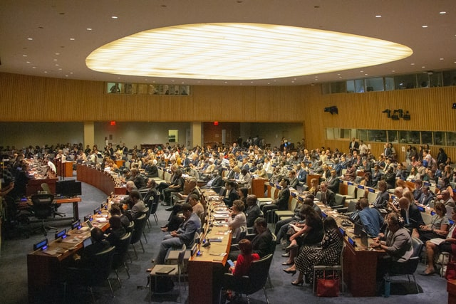

# **Com fer Big Data des de casa en una pandèmia**

**Xerrada Setmana d'Orientació**
INS Gabriela Mistral
16 de febrer de 2021

---

# **Alberto Cámara**

github: **@ber2**

web: **ber2.github.io**

- Matemàtic (Barcelona, Nottingham)

- Data Science / Engineering

---

# Stack

- C
- **Python**
- **SQL**
- **Scala**
- Haskell

# Eines

- GNU/Linux (Ubuntu)

---
<!-- _class: -->

- Agència __global__ de publicitat online, **AdTech**

- Equip tècnic distribuit entre Londres i Barcelona

- Construim __audiències__ basades en els hàbits de navegació

---

<!-- _class: -->

# Tenim **Big Data**

Cal fer servir **càlcul en paral·lel** per gestionar aquest volum

---
<!-- _class: -->

## Serveis que oferim

* En temps real
  * Sincronització de cookies (1)
  * Adserver

* En diferit
  * Sincronització de cookies (2)
  * Entrenament i desplegament de models de Machine Learning
  * Reporting sobre el comportament de les audiències
  * Servim una plataforma de trading d'ús intern

---
<!-- _class: -->

## Algunes tecnologies que fem servir

- Cloud computing: **Amazon Web Services**, **Databricks**

- Realtime: **Kafka**, **Go**

- Càlcul en paral·lel, reporting: **Apache Spark**, **AWS Redshift** (SQL basat en PostgresQL)
- Machine Learning: **Apache Spark** + **Python** (**scikit-learn**). 

---

# **El dia a dia en aquesta feina**
## (abans i després de)

---

---

---

# Un dia típic

* 08:00h: **Mail**, **Slack**, **Calendar**, **Jira**, **Trello**
  * Si hi ha alertes, distribuir feina amb els companys

* 08:30h: Començar a picar codi. Metodologia **Agile**
  * **Test-Driven Development**, **Github**, **Jira** 

* 11:20h: Daily Stand-up Meeting

* 13:00h: Dinar

* 17:30h: Plegar 

---

---

---

---

# Moltes videotrucades

- Google Meet 
  - Coffee room

- Pair programming
  - VS Code LiveShare

---

# Formació contínua

- Coursera
- Meetups i webinars
  - Networking
- Blogs, tutorials

--- 

# El sector tecnològic a Barcelona

* Té bona salut
* Laboralment hi ha més demanda que oferta
* La pandèmia:
  * Introdueix molta flexibilització: **remote-first**
  * Ha complicat l'entrada de **juniors** a les empreses

---

# Consells

* El procés de cerca de feina pot ser llarg
* Poden passar mesos des que es comença a buscar feina fins que es troba
* Ser rebutjat forma part del procés; cal conservar ànim i calma, seguir enviant CVs i demanar feedback
* El mètode que millor funciona és la **recomanació interna**
* **LinkedIn**
* Mostres de feina a **GitHub**

