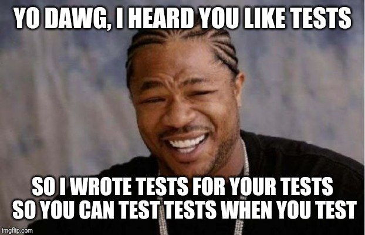
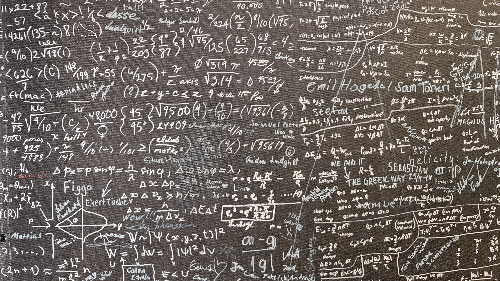
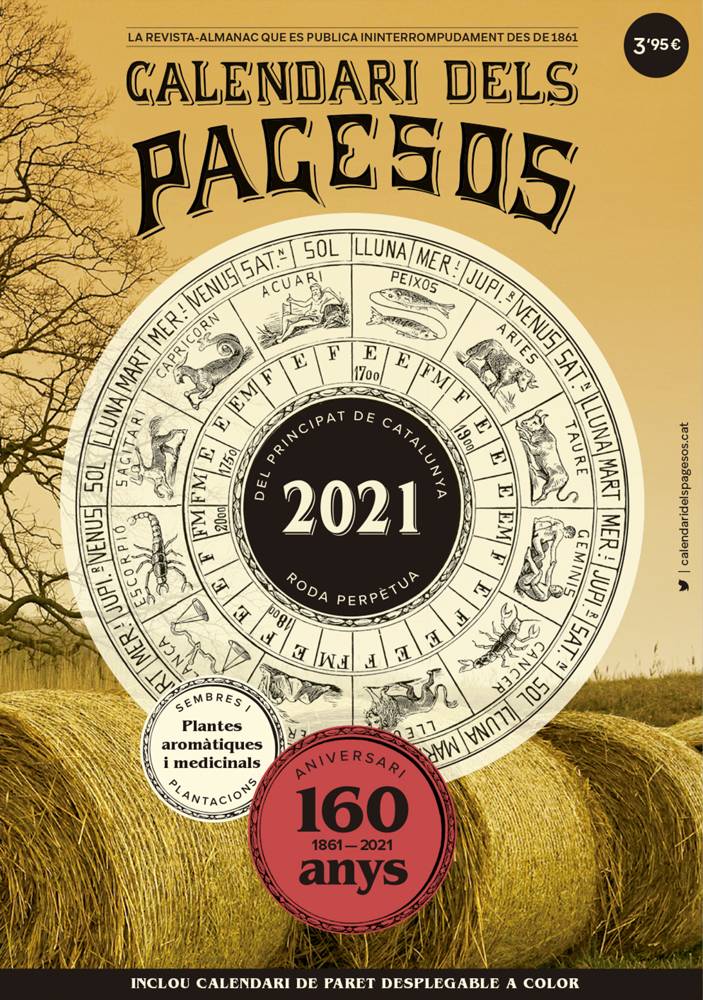
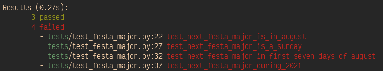
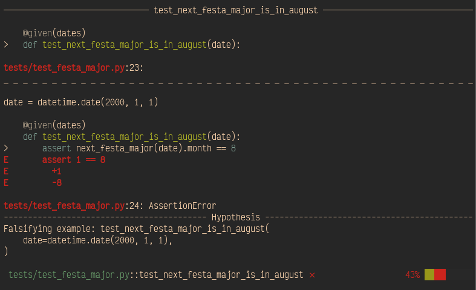
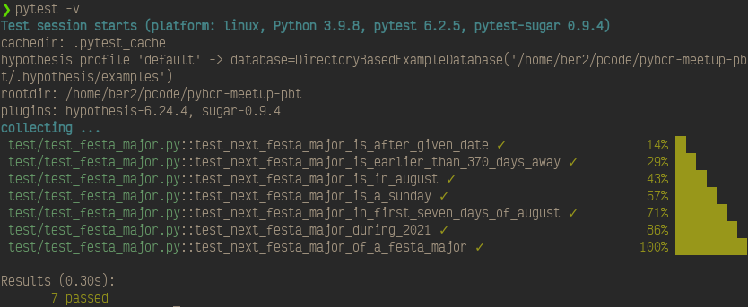
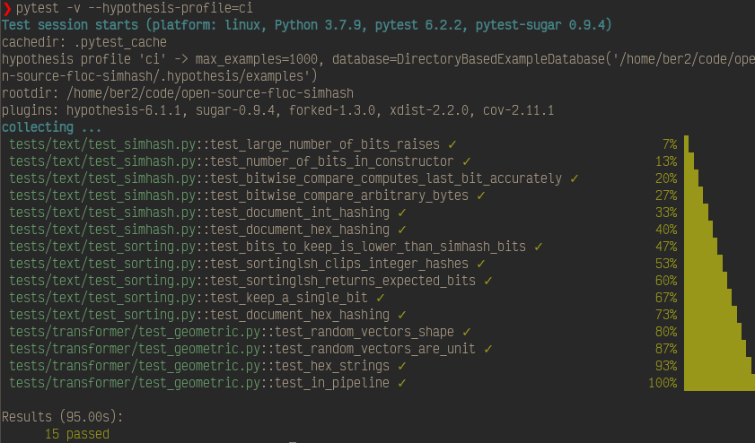
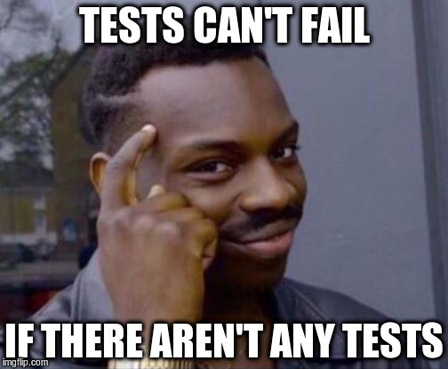

<!-- _class: -->

# **Property-based testing in Python using Hypothesis**


**Alberto Cámara**
**PyBcn Meetup**
TravelPerk
2021-11-25

---

# **Alberto Cámara**


github: **[@ber2](github.com/ber2)**

web: **ber2.github.io**

- Maths PhD

- Data Science & Engineering

- Member of [PyBcn](pybcn.org)

- Code mostly in Python & Scala


---
<!-- _class: -->


- I work as a Lead Data Scientist at **[Hybrid Theory](hybridtheory.com)**. **We are hiring**

- **Global AdTech** agency. We process ~2B events per day

- Remote Engineering team based mostly off London and Barcelona

- My colleague **Alejandro Nicolás** will talk at PyDay 2021 about **Burnout paradise**

---

<!-- _class: -->



# When should we test code?

* **Israel Saeta** (**[@dukebody](github.com/dukebody)**): **[Test-Driven Development in Python](https://www.youtube.com/watch?v=Rer4ViPsyKQ)**, Webinar at Python Madrid.

* Beyond coverage, we should leverage the trade-off between the benefit of having tests and the cost of writing and maintaining them.

---
<!-- _class: -->


---

<!-- _class: -->


# Example-based testing

Manually specify example fixtures and expected return values.

```python
def sum(a: int, b: int) -> int:
    return a + b

def test_sum():
    assert sum(2, 3) == 5
```

---


# Property-based testing

* Focus on defining properties that should hold in all cases

* Use a helper library to generate random fixtures

* Run each test on a multitude of fixtures

* Excels at unit testing **pure functions**

* Popularised originally by the Haskell library **[QuickCheck](https://hackage.haskell.org/package/QuickCheck)**

* **[Hypothesis](https://hypothesis.readthedocs.io/en/latest/)** is the leading Python library

---



<!-- _class: -->
## Properties of `sum`

Install Hypothesis:
```bash
pip install hypothesis
```
Then:
```python
from hypothesis import given
from hypothesis.strategies import integers

def sum(a: int, b: int) -> int:
    return a + b

@given(integers(), integers())
def test_sum_commutes(a: int, b: int):
    assert sum(a, b) == sum(b, a)
```

---

## Hypothesis provides:

- A `given` decorator to randomly generate fixtures

- A package, `hypothesis.strategies`, providing methods to generate random data of the most common types

- Methods to generate your own testing strategies for more complicated data

- Integration with pytest: useful test failure messages

---



# An exercise in TDD with dates

Because if you have imported `datetime`, you have struggled with dates.

* Festa Major in Sant Esteve Sesrovires:
**First Sunday of August**.

* **Problem**: print the date of the next Festa Major.

---

<!-- _class: -->

# Code skeleton

```python
import datetime as dt


def next_festa_major(date: dt.date) -> dt.date:
    return date


if __name__ == "__main__":
    today = dt.date.today()
    next_fm: dt.date = next_festa_major(today)
    print(f"Today is {today}. The next Festa Major will be on {next_fm}")
```

---
<!-- _class: -->
# Example-based tests

```python
def test_next_festa_major_during_2021():
    assert next_festa_major(dt.date(2021, 3, 7)) == dt.date(2021, 8, 1)
    assert next_festa_major(dt.date(2021, 8, 15)) == dt.date(2022, 8, 7)
```
```python
def test_next_festa_major_of_a_festa_major():
    next_date = dt.date(2022, 8, 7)
    assert next_festa_major(next_date) == next_date
```
---
<!-- _class: -->

# Properties of `next_festa_major`?

* It is either equal to or after the given date
* It is earlier that _one year_ away
* It is in August
* It is on a Sunday
* It is _early_ in August

---
<!-- _class: -->

Let us code these properties into tests

```python
import hypothesis.strategies as st


dates = st.dates(max_value=dt.date(3000, 1, 1))


@given(dates)
def test_next_festa_major_is_after_given_date(date: dt.date):
    assert date <= next_festa_major(date)
```

---
<!-- _class: -->

```python
@given(dates)
def test_next_festa_major_is_earlier_than_370_days_away(date: dt.date):
    assert (next_festa_major(date) - date).days <= 370
```
---
<!-- _class: -->

```python
@given(dates)
def test_next_festa_major_is_in_august(date: dt.date):
    assert next_festa_major(date).month == 8
```

---
<!-- _class: -->
```python
@given(dates)
def test_next_festa_major_is_a_sunday(date: dt.date):
    assert next_festa_major(date).isocalendar()[2] == 7
```

---
<!-- _class: -->
```python
@given(dates)
def test_next_festa_major_in_first_seven_days_of_august(date: dt.date):
    assert next_festa_major(date).day in range(1, 8)
```
---

Next, run the tests to verify that we have a failing test suite.



---



---

<!-- _class: -->
Next: add enough code to make the tests pass.

```python
def next_festa_major(date: dt.date) -> dt.date:
    this_years_festa_major = _first_sunday_of_august(date.year)
    next_years_festa_major = _first_sunday_of_august(date.year + 1)

    if date <= this_years_festa_major:
        return this_years_festa_major
    return next_years_festa_major
```

```python
def _first_sunday_of_august(year: int) -> dt.date:
    weekday_of_august_first = dt.date(year, 8, 1).isocalendar()[2]
    missing_days = 7 - weekday_of_august_first
    return dt.date(year, 8, 1 + missing_days)
```

---



---

# Other cool stuff Hypothesis does

* When a test fails, it reduces the example towards a minimal one.

* `composite` strategies and `map`, `flatmap` and `filter` on strategies.

* Configurable test timeouts

* Definition of profiles with different sampling strategies.

---



# Extras

- **Django**

- **pandas**, **numpy**

--- 



# Thanks!


#### Materials for this talk:

Code: github.com/ber2/pybcn-meetup-pbt
Slides: ber2.github.io/slides/2021-11-25-pybcn-meetup

