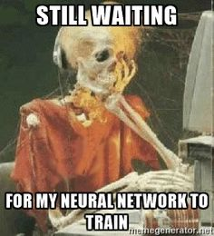

<!-- _class: -->

# **The Archival Datathon**
 
**Alberto Cámara**
**Hybrid Theory Tech Talk**
2022-07-01

---
# The Archival Problem

* We are given short text titles
  - Origin: OCR scans of titles of archive documents
  - Full of typos and spelling mistakes, not cleaned
* Documents have a topic classification label: _QdC_

<!-- Show challenge overview and data -->

---

# An analogy

* **The Archival Problem**
  - Dirty & short OCR text $\longrightarrow$ Classify by topic
  - Unbalanced **multilabel** classification problem
  - Optimize for **F1-score**

* **The Lookalikes Problem**
  - URL tokens $\longrightarrow$ Classify converters
  - Unbalanced **binary** classification problem
  - Optimize for **AUROC**

---

# Agile approach to the problem

We need to be able to **iterate fast**

* Choice of weapons
* The _data engineering_ bits need to be automatised away ASAP:
  - Load training data
  - Make a submission to Kaggle
* Aim at having a clear Machine Learning pipeline structure.

---

# Choice of weapons

- **Pandas profiling** for dataset exploration
- **Git** + **DVC** for data versioning
- **MLflow** for experiment tracking and model registry
- **Jupyter Lab** for running almost everything

<!-- Exploration: look for the inbalance in the classes -->
<!-- The point of versioning data and models is reproducibility -->
<!-- Do not pay attention to good engineering practices: testing is superseded by validation, code duplication is faster than solving python import paths -->

---

# Pipeline structure

- Read training data into numpy arrays
- Feature engineering
- Model Selection & Fit
- Submission of a given MLflow run to Kaggle

### **Critical**: make your first submission ASAP

---

# My first submission

- No text cleaning (but filtering **nltk** stopwords for Catalan)
- Vectorization: played with **bag-of-words** & **tf-idf**
- Model: logistic regression & linear SVM classifier
- Score on public testing dataset: $0.92586$

<!-- Winning public score: 0.93262 -->
<!-- Winning private score: 0.93111 -->

---

# Kaggle competitions vs Business

* The rest of the time went by attempting to get to $0.93$
* Many practices were attempted, sometimes running into serious overfitting
  - Feature engineering
  - Model fine-tuning

<!-- 4/7 people went above 0.90 -->
<!-- 2/7 people went above 0.93 -->
<!-- Feature engineering typically has an impact of one order of magnitude higher -->

---

# Feature Engineering

- Stopword removal
- Lemmatization
- Accent removal
- Spelling corrections
- Different vectorization methods
  - By unigrams and bi-grams
  - **fastText** word embeddings in Catalan, dim. 300 

---

# Model selection

- Wide range of scikit-learn models (spoiler: no model overtook `LinearSVC`)
- Comprehensive grid-searches for optimal parameters
- Neural networks on top of fastText embeddings

---

# Chronology

* **Day 1**: Competition starts, first submission scores $0.92586$
* **~Day 3**: Other competitors start making submissions
* **Day 4**: Toni challenges the leading position
* **Day 5**: Toni takes leadership
* **Day 6**: I overtake with the first submission over $0.93$
* **Day 7**: Toni overtakes with his final submission

<!-- Meri complained I was spending all my free time in front of the computer until she learned of the prize money -->
<!-- Look at final scores -->

---

# Result

- The winner was decided on a difference of $0.00199$ score points
- Both scores went down on the private validation dataset due to **overfitting**

---

# Thanks!
