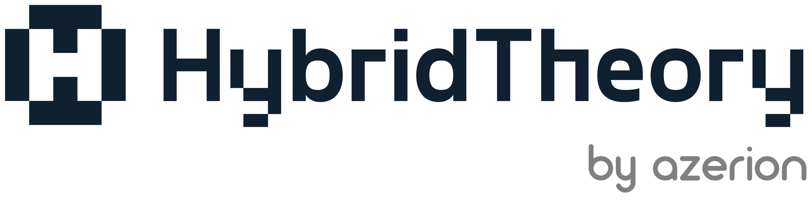
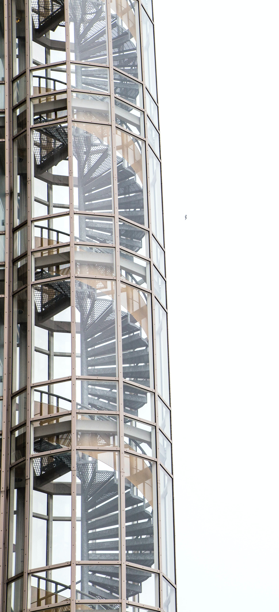
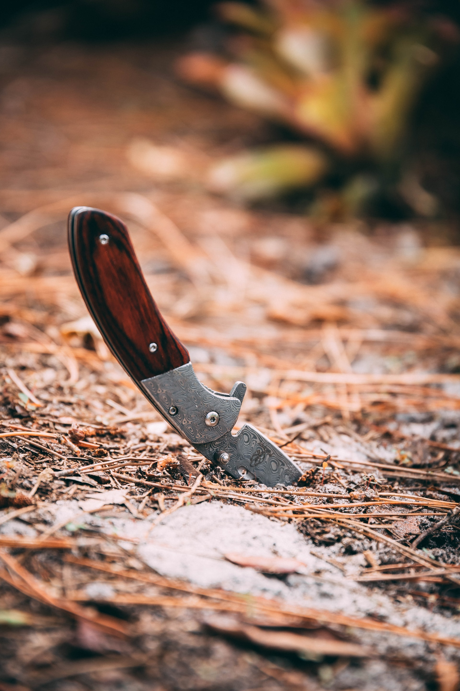
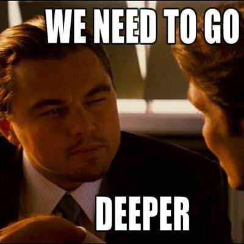
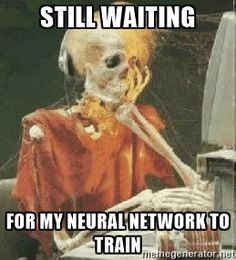
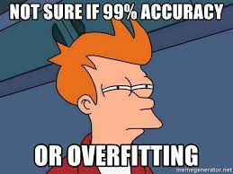

<!-- _class: -->

# **The Archival Datathon** 
## **ML Competition tips**
 
### **Alberto Cámara**
**PyBcn Meetup March 2023**
2023-03-30

---

# **Alberto Cámara**

github: **[@ber2](github.com/ber2)**

web: **[ber2.github.io](https://ber2.github.io/)**

- Maths PhD

- Data Science & Engineering

- [PyBcn](https://pybcn.org/) member (join us!)

- Code mostly in Python & Scala

---
<!-- _class: -->

- I work as a Lead Data Scientist at [Hybrid Theory](https://hybridtheory.com/), now part of [Azerion Group](https://www.azerion.com/)

- **Global AdTech** agency. We process ~100B monthly events

- Remote Engineering team based mostly around Barcelona

---

# Today's goals

- Review the **Archival Datathon** Kaggle competition.
- Discuss how to be agile when approaching an ML problem.
- Learned lessons for doing **ML in Production**. 

---

# The Archival Problem

* Ran from May 7th to 13th, 2021
* We are given short text titles
  - Origin: OCR scans of titles of archive documents
  - Full of typos and spelling mistakes, not cleaned
* Documents have a topic classification label: _QdC_
* We are given a **full training dataset** and a **portion of the validation dataset**
* Optimize for F1-score

<!-- Show challenge overview -->
<!-- Datathon: https://www.kaggle.com/competitions/archivalDatathon/ -->
<!-- Profiling: file:///home/ber2/archivalDatathon/training_profile.html -->

---
<!-- _class: -->

# Let's have a quick look

Datathon [website](https://www.kaggle.com/competitions/archivalDatathon/)

Data overview

---

# Agile approach to the problem

We need to be able to **iterate fast**

* Choice of weapons
* The _data engineering_ bits need to be automatised away ASAP:
  - Load training data
  - Make a submission to Kaggle
* Aim at having a clear Machine Learning pipeline structure.

---

# Choice of weapons

- **YData profiling** (formerly Pandas Profiling) for dataset exploration
- **Git** + **DVC** for code + data versioning
- **MLflow** for experiment tracking and model registry
- **Jupyter Lab** for running almost everything on notebooks

<!-- Exploration: look for the inbalance in the classes -->
<!-- The point of versioning data and models is reproducibility -->
<!-- Do not pay attention to good engineering practices: testing is superseded by validation, code duplication is faster than solving python import paths -->

---

# Pipeline structure

- Read training data into numpy arrays
- Feature engineering
- Model Selection & Fit $\longrightarrow$ Save to MLflow
- Submission of a given MLflow run to Kaggle

### **Critical**: make your first submission ASAP

---

# My first submission

- No text cleaning (but filtering **nltk** stopwords for Catalan)
- Vectorization: played with **bag-of-words** & **tf-idf**
- Model: logistic regression & linear SVM classifier
- Score on public testing dataset: $0.92586$

<!-- Winning public score: 0.93262 -->
<!-- Winning private score: 0.93111 -->

---

# Kaggle competitions vs Business

* The rest of the time went by attempting to get to $0.93$
* Many practices were attempted, sometimes running into serious overfitting
  - Feature engineering
  - Model fine-tuning

<!-- 4/7 people went above 0.90 -->
<!-- 2/7 people went above 0.93 -->
<!-- Feature engineering typically has an impact of one order of magnitude higher -->

---

# Feature Engineering

- Stopword removal
- Lemmatization
- Accent removal
- Spelling corrections
- Different vectorization methods
  - By unigrams and bi-grams
  - **fastText** word embeddings in Catalan, dim. 300 

---

# Model selection

- Wide range of scikit-learn models (spoiler: no model overtook `LinearSVC`)
- Comprehensive grid-searches for optimal parameters
- Neural networks on top of fastText embeddings

---

# Chronology

* **Day 1**: Competition starts, first submission scores $0.92586$
* **~Day 3**: Other competitors start making submissions
* **Day 4**: Toni Lozano challenges the leading position
* **Day 5**: Toni takes leadership
* **Day 6**: I overtake with the first submission over $0.93$
* **Day 7**: Toni overtakes with his final submission

---

# Result

- The winner was decided on a difference of $0.00199$ score points
- Both scores went down on the private validation dataset due to **overfitting**

---
<!-- _class: -->

# Differences with doing ML in Production

* It rarely pays to overoptimize the model. Prefer slightly less performant models that can be **explained**.
* **Performance** and **dependencies** will be an issue.
* Keep tracking code, data & models:
  - Introduce **dataset versioning** & **feature store** $\longrightarrow$ **Data Catalogue**
  - Track & store models $\longrightarrow$ **Model Registry**
* Introduce **good practices** for software development
  - Stay away from notebooks $\longrightarrow$ **ML Engineering**
  - **Test** your code profusely
  - **Define** validation metrics $\longrightarrow$ **Continuous Monitoring**

---

# Thanks!

A few links:

- Kaggle Competition [frontpage](https://www.kaggle.com/competitions/archivalDatathon/)
- [Code](https://www.kaggle.com/code/b3r2ss/tfidf-linearsvc) for the winning attempt
- [DVC](https://dvc.org/), [MLflow](https://mlflow.org/), [YData Profiling](https://github.com/ydataai/ydata-profiling)
