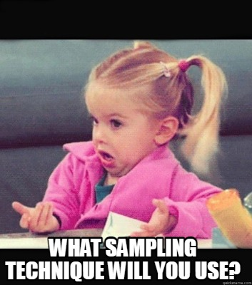
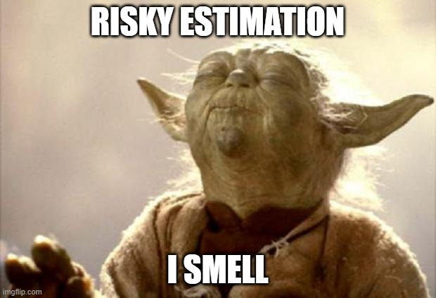
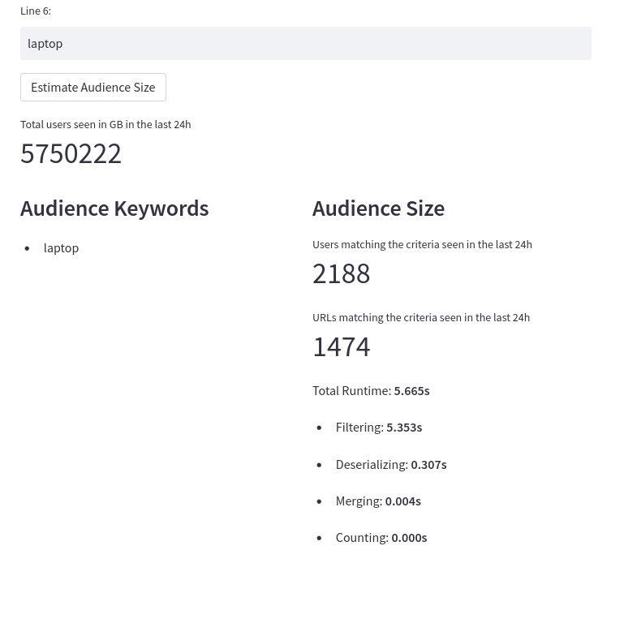
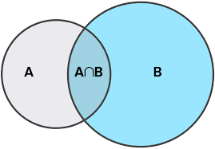

# **Using Data Sketches** to extract Fast & Cheap Insights from Big Data

**Alberto Cámara**, Lead Data Scientist
**DevBcn 2023**, 2023-07-04

--- 

# **Alberto Cámara**


github: **[@ber2](github.com/ber2)**

web: **[ber2.github.io](https://ber2.github.io/)**

- **Maths PhD**

- Doing **Data things** in general, mostly **Science**

- Code mostly in **Python** & **Scala**

- Heavy user of **Apache Spark**

---

## Where I work


- I lead a Data Science team at [Hybrid Theory](https://hybridtheory.com/), now part of [Azerion Group](https://www.azerion.com/)

- **Online games** and **Online Advertising**

- Several remote engineering teams in Europe, my team is mostly around Barcelona

---

## Python Barcelona Community


Dedicated to fostering the Python Community in Barcelona
- [PyBcn.org](https://pybcn.org/) member (join us!)
- Organiser of monthly Meetups (propose a talk / venue)
- Frequent **PyDay** events organised

---

# Problems when reporting Big Data

---


- We process ~100B monthly events at **Hybrid Theory** from different sources, related to web traffic.
- Reconstructing a user's browsing history involves **slow & expensive** joins of very large tables.
- Most _interesting_ business questions involve **slow aggregation queries** on top of such joins.

---


## An example: building an interest audience 

A web traffic event can have the following dimensions:

```
(timestamp, user id, country, device type, url tokens)
```

**Definition**: a _segment_ is the set of users having expressed a common trait in their browsing behaviour.

**Example**: the list of user ids that have browsed any website containing the keyword `laptop`.

---


We routinely build segments and refresh them every 3h.

We make them available for internal use in our own campaigns, and externally by selling them in several marketplaces.

* **Problem**: count the number of users in a segment without actually building it.

* Prefer **fast approximated estimation** instead of **slow exact computation**.

---



## What to do

* **Sampling**: only take into consideration a small subset of the data.

* **Preaggregate**: precompute and store aggregations on most common dimensions of the data, then compute further aggregations as needed.


---



There are two types of KPIs appearing in these aggregations, regardless of whether we sample or preaggregate:

* **Additive (easy)**: counting total events, a sum, an average...

* **Non-additive (hard)**: counting distinct values, most frequent value...


---

## Preaggregations

For audience size estimation, sampling produces very large errors.

**Preaggregation idea**: pass through the data on a daily basis and save aggregations across common access patterns.

* For additive KPIs, store enough information to re-aggregate later.

* For many non-additive KPIs, it is possible to store a **sketch**.

---

## What is a sketch?


Given a set $X$, a _sketch_ of $X$ is a set $S$ containing a _summary of numerical data_ calculated from values of $X$, such that:

- Given a new value $x$, we can compute a sketch for $X \cup \left\{ x \right\}$ from $S$.
- Given two sets $X$ and $Y$ with sketches $S$ and $T$, we can compute a sketch for $X \cup Y$ from $S$ and $T$.
- It is possible to recover statistical information about $X$ by looking only at $S$, with a bounded error.

---


In practice:
- $S$ is much smaller than $X$.
- $S$ can be computed in a single passing through $X$ and stored in constant memory. 
- $S$ is obtained by retaining information related to hashes of the elements in $X$.

---

```scala
trait CountingSketcher[S] {
  def emptySketch: S
  def update(a: S, s: String): S
  def union(a: S, b: S): S
  def getEstimate(a: S): Double
  def serialize(a: S): Array[Byte]
  def deserialize(xs: Array[Byte]): S
}
```

In order to build a sketching algorithm for unique counts:
- Extend this trait
- Test quality of estimates
- Test internal consistency of methods

---

### Audience size estimation via sketches

* **Daily aggregation**: take web browsing events, aggregate and store them.
  * From: `(timestamp, user id, country, device type, url tokens)`
  * To: `(date, country, url tokens, sketch of user ids)`

* **Further, on-demand aggregation**: given a keyword such as `laptop`,
  * Filter on `url tokens`
  * Re-aggregate surviving sketches into a single sketch
  * Obtain estimate from sketch

---

## A few fantastic algorithms...

* Flajolet, Martin et al (1985). **HyperLogLog / HyperLogLog++**. Uniques count.
* Broder et al (1997). **MinHash** / **K-Minimum Values**. Jaccard indices.
* Dasgupta, Lang et al (2016) **Theta Sketch Framework**. Set-theoretic operations in general.

---

## ...and where to find them

* HyperLogLog++ powers `approx_count_distinct()` methods in many databases: Postgres, Apache Spark, Redis...
* **Apache Datasketches** project: Java & C++ implementations of many algorithms, with Python bindings.
* **Datasketch**: Python implementations of HyperLogLog & MinHash
* **spark-sketches** (WIP): compatible implementations of MinHash & Theta in Scala & Python with Spark UDFs.

---

# The Theta Sketch in Scala

---

```scala
case class Theta(theta: Double, hashes: Set[Long])
```

- `Theta` acts as an instance of `S`.
  - `hashes` stores a few of the smaller hash values.
  - `theta` starts at `1.0` and lowers as we keep adding values to the sketch. It acts as a threshold for data not added to `hashes`.

---

```scala
class Sketcher extends CountingSketch[Theta] {
  val emptySketch = Theta(1.0, Set.empty[Long])

  def update(a: Theta, s: String): Theta = {
    // A manipulation on the hash bits of s that decides whether:
    //    1. The value of a.theta needs to be lowered.
    //    2. A new element needs to be added to a.hashes.
    //    3. Hashes below a.theta are discarded.
  }

  def union(a: Theta, b: Theta): Theta = {
    val th = min(a.theta, b.theta)
    val hs = (a.hashes ++ b.hashes).filter(_ < th)
    Theta(th, hs)
  }

  def getEstimate(a: Theta): Double = a.hashes.size.toDouble / a.theta
}
```

---

# Taking it over to Spark

---

Spark provides a base class `org.apache.spark.sql.expressions.Aggregator` that, for practical purposes, looks as follows:

```scala
import org.apache.spark.sql.{Encoder, Encoders}

abstract class Aggregator[-IN, BUF, OUT] {
  def zero: BUF
  def reduce(buffer: BUF, value: IN): BUF
  def merge(b1: BUF, b2: BUF): BUF
  def finish(reduction: BUF): OUT

  // Will leave these out of the discussion
  def bufferEncoder: Encoder[BUF]
  def outputEncoder: Encoder[OUT]
}
```

---

Now, we can define an aggregator for values into a column of `BinaryType` using:

```scala
import org.apache.spark.sql.expressions.Aggregator

val sk = new Sketcher

object SketchPreaggregator
    extends Aggregator[String, Theta, Array[Byte]] {
  def zero: Theta = sk.emptySketch
  def reduce(b: Theta, a: String): Theta = sk.update(b, a)
  def merge(b1: Theta, b2: Theta): Theta = sk.union(b1, b2)
  def finish(reduction: Theta): Array[Byte] = sk.serialize(reduction)
}

```

---

Next, we can further aggregate a column of sketches via:

```scala
object SketchAggregator
    extends Aggregator[Array[Byte], Theta, Array[Byte]] {
  def zero: Theta = sk.emptySketch
  def reduce(b: Theta, a: Array[Byte]): Theta = sk.union(b, sk.deserialize(a))
  def merge(b1: Theta, b2: Theta): Theta = sk.union(b1, b2)
  def finish(reduction: Theta): Array[Byte] = sk.serialize(reduction)
}
```

---

Finally, we can register some UDFs and UDAFs based on the above and use them on DataFrames.

```scala
import org.apache.spark.scala.sql.{udaf, udf}

val stringsToSketch = udaf(SketchPreaggregator)
val aggSketches = udaf(SketchAggregator)
val getEstimate = udf(sk.getEstimate(sk.deserialize(_)))
```

```scala
val urlSketches = events
  .groupBy(to_date($"ts") as "dt", $"country", $"url_tokens")
  .agg(stringsToSketch($"user_id") as "sketch")
```

```scala
val estimates = urlSketches
  .filter($"url_tokens" like "%laptop%")
  .agg(aggSketches($"sketch") as "sketch")
  .withColumn("unique_users", getEstimate($"sketch"))
```

---

# What is this good for?

---

## Turning audience size estimation around

* **Previous approach**:
  * Create the audience, add it to segment building jobs
  * Push user ids to campaigns
  * Obtain audience size as a reporting by-product

* **Current development**: 
  * Give audience definition
  * Obtain real-time size estimations
  * Iterate or start building segment

---

# Demo time!

---



---



## Reporting segment overlaps

The goal is to report the number of users in common for each pair of segments defined on our Platform, on a daily basis.

* **April, 2020**. Initial development using SQL joins on our **AWS Redshift** warehouse.
* **March, 2021**. Introduce a **sampling** approach with large errors, discard computing small intersections. Computation becomes _manageable_.
* **November, 2022**. Move to **Apache Spark**, use **minhash sketches** to compute intersections. Accurate estimates, faster computation.

---

## Into the future

* Cost-saving efforts: revisiting existing reports in order to apply sketching strategies.
* Abandon batch reporting job runs in favour of on-demand near-real-time reporting.
* Export this approach to the rest of the organisation.

---


# Thanks!

A few links:

- Apache Datasketches project: https://datasketches.apache.org
- Scala / Spark implementation of discussed code: https://github.com/ber2/spark-sketches
