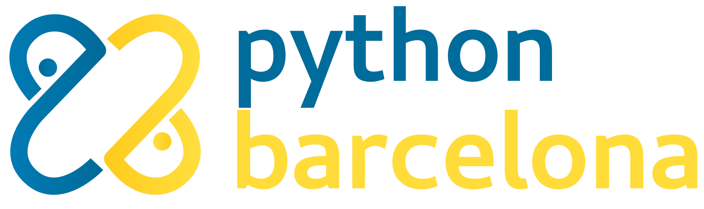
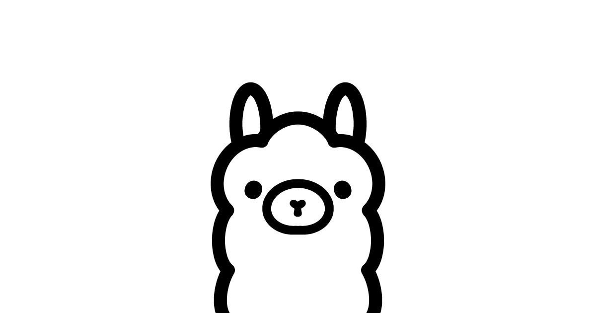

# Un tastet de **Python**

**Alberto Cámara**
**INS Gabriela Mistral**, 2025-02-02


---

# About me


- Matemàtic 
- Científic de Dades
- Membre de **PyBcn**

---

# Què farem avui?

- Què és Python? Alguns conceptes bàsics
- Per a què s'usa Python?
- Large Language Models. Ollama
* **Fes el teu propi chatbot**

---


# Què és Python?

És un llenguatge de programació creat per **Guido van Rossum** el 1991:

* **Interpretat** (en comptes de compilat)
* **De tipatge dinàmic** (en comptes d'estàtic)
* Fàcil d'aprendre (llegibilitat i sintaxi)

---



Python...
- és de codi obert
- té una comunitat molt activa que:
    - governa la implementació del llenguatge
    - proporciona moltíssimes llibreries

A Barcelona tenim l'associació **PyBcn**: ens trobareu a [pybcn.org](https://pybcn.org)

---


És molt habitual veure Python usat per a:

* Programació científica i càlcul numèric
* Programació backend
* Automatització
* Anàlisi de Dades, Big Data
* Intel·ligència Artificial

---

# Primer tastet

Hauríeu de tenir **Python** instal·lat a les vostres màquines.

- Obriu un terminal (`Win + R`, escriviu `cmd`, premeu intro).

- Escriviu `python` i premeu intro.

Hauríeu de veure alguna cosa així:

```
Python 3.x.x (default, ...) 
Type "help", "copyright", "credits" or "license" for more information.
>>>
```

---

terminal

---

# LLMs


Els **Large Language Models** són models d'aprenentatge automàtic que són capaços de generar text amb resultats espectaculars.

Salten a la fama a finals de 2022 amb la publicació de **ChatGPT**, de OpenAI.

Actualment hi ha una gran competició per acaparar la **IA Generativa**: empreses, països, control dels xips, control de les matèries primeres per fabricar xips...

---

# LLMs Open Source

Hi ha jugadors que aposten per publicar els seus models, de manera que puguin ser estudiats i adaptats. A destacar:

- Els models `llama`, publicats per **Meta**
- `deepseek`, apareguts molt recentment 
- `mistral`

---

# Segon tastet



Hauríeu de tenir instal·lat **Ollama**.

Executeu:

```bash
> ollama run llama3.2:3b
```

Si no teniu prou memòria (<10 RAM):
```bash
> ollama run llama3.2:1b
```

Podríem preguntar, per exemple:
```
>>> Can you give me a short description of what Python is as a programming language?
```
---

Per tal de permetre que un programa python es comuniqui amb un LLM d'Ollama, cal instal·lar una llibreria:

```
> pip install ollama
```

Finalment, podeu descarregar el fitxer `trivial_pursuit.py` del Moodle.

---

terminal

