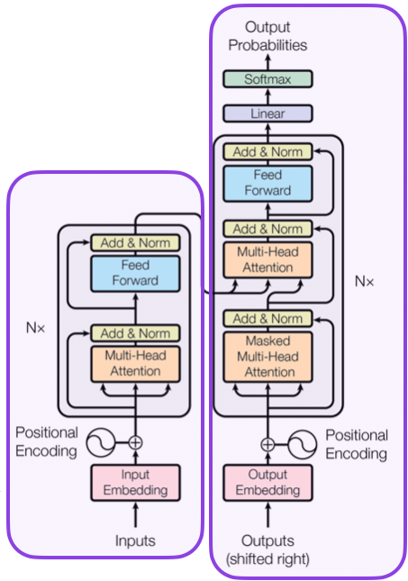
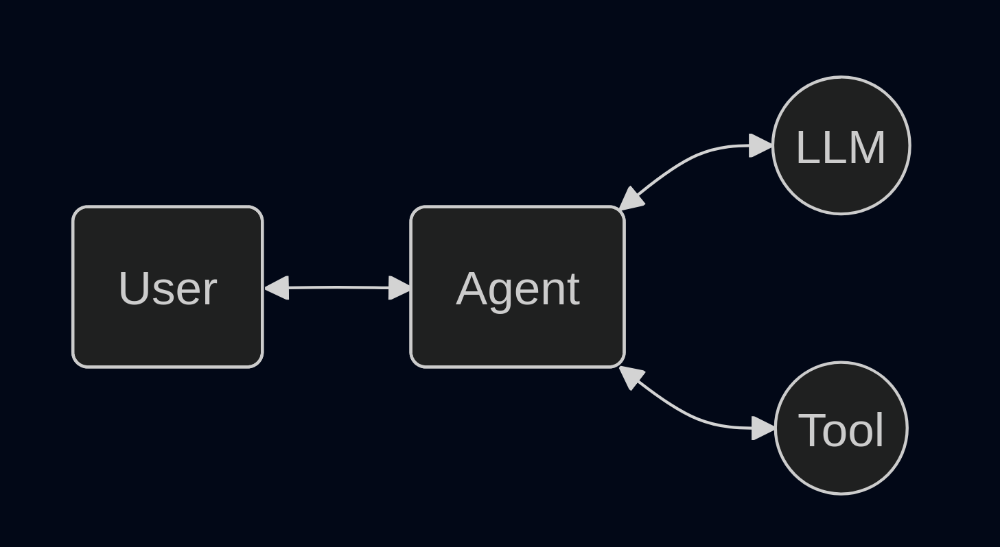
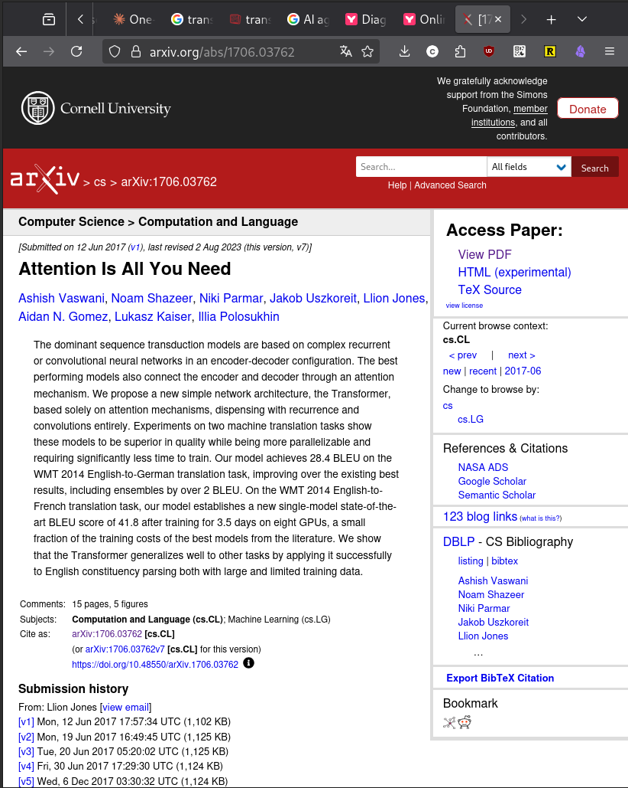
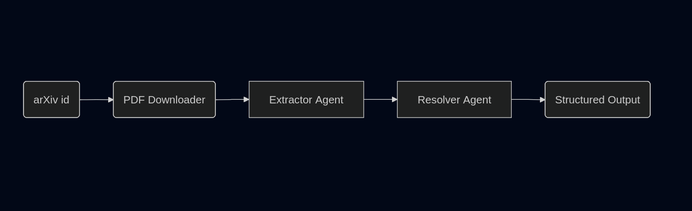

---
class:
  - lead
  - invert
marp: true
theme: default
paginate: true
footer: Alberto Cámara - PyDay 2025-11-29

---

# Building AI Agents with Pydantic AI

### **Alberto Cámara**
**PyBcn PyDay 2025**
2025-11-29

---

# **Alberto Cámara**


github: **[@ber2](github.com/ber2)**

web: **[ber2.github.io](https://ber2.github.io/)**

- **Maths PhD**

- Working as a **Data Freelancer**, on the lookout for _interesting_ projects

- One of the **PyBcn Monthly Meetup** organisers

- Passionate **Python** heavy user

<!--
Working a bit in all areas of the Data spectrum but specializing in Data Science, ML Engineering

Wouldn't call myself a python expert

Thanks to the PyDay organisers for putting everything together
-->

---


## AI is like high school sex

Most people are talking about it.
A few are actually doing it.
Hardly anyone is doing it well.

<!--
This applies to pretty much any trending tech.

Seen it for Big Data, AI, etc
-->

---



## A glossary of terms

* **LLM** - A neural network that can predict and generate text
* **Agent** - A system that perceives its environment and takes actions to achieve goals
* **AI Agent** - An agent which is autonomous and uses LLMs to decide which actions to take

<!--
LLM is a very loose definition because it depends on the size of the NN and how feasible the generated text is

Agent comes from RL
-->

---




<!--
A simple starting picture

This can become as complicated as necessary: sequence of actions, loops...
-->

---



## Today we will be working with **arXiv papers**

- Open-access repository of scientific papers
- Standardized paper IDs
- Over 2 million papers across physics, math, CS, etc.


<!--
**Why a good example?**
- Real-world PDFs with messy data
- Structured but inconsistent formatting
- Perfect for extraction tasks
-->

---

## Our Challenge: Parse Author Data

**Input:** arXiv paper id 

**Output:** Structured author and affiliation data

**Example:**
```json
{
  "arxiv_id": "1706.03762",
  "authors": [
    {
      "name": "Ashish Vaswani",
      "affiliations": ["Google Brain"]
    }
  ]
}
```
---




<!--
Two-agent architecture

Extractor is responsible for reading whole paper and getting info about authors and affiliations.

Resolver is responsible for normalising affiliations into standardized names and raising issues.

Automatic author affiliation btw is a real problem
-->

---


## Why use Pydantic?

- **Data validation** library for Python
- Built around **type safety** and **structured data**

* Uses **Rust** under the hood
* Used in **FastAPI**, **LangChain**, **SQLModel** and many other projects

<!--
A large part of the interaction with LLMs revolves around validating their outputs.

Pydantic does modern python by leveraging type hints.

There is a very nice pattern of modelling your IOs as Pydantic models and then building an API on top is almost automatic.
-->

---

## Pydantic AI

It is a Python framework designed to build apps and workflows with AI agents.

* Focus on extraction of **structured data** from **unstructured sources**

* **Type-safe outputs** guaranteed by Pydantic models

* **Model Agnostic**: designed so that it is possible to switch LLMs without changing code

<!--
Model agnostic is important due to the speed at which SOTA changes

Do not get married to a provider or a particular LLM
-->

---

## Alternatives Comparison

- **Pydantic AI**: Structured extraction, simple API, lightweight
- **LangGraph**: Complex workflows, state machines, broader scope
- **LlamaIndex**: RAG pipelines, PDF extraction, heavyweight

* All are **model agnostic**: Ollama, Gemini, OpenAI, etc
* All accept validation against Pydantic models 

<!--
See Enric's workshop earlier for LangGraph

Really useful tools each with its use case
-->

---

# Let's code!

### https://github.com/ber2/2025-pyday-multiagents-pydantic-ai

---

# Possible Extensions

- **More agents:** Add citation extractor, abstract summarizer
- **Add validation loops:** Resolver calls Extractor back in case of normalization issues
- **Batch processing:** Process multiple papers
- **Export formats:** JSON, CSV, database
- **Integration:** Connect to reference managers
- **Better validation:** Use external APIs (ORCID, ROR)

---

## Resources

**Documentation:**

- Pydantic AI: https://ai.pydantic.dev
- Ollama: https://docs.ollama.com/
- Logfire: https://logfire.pydantic.dev

---

# Thanks

