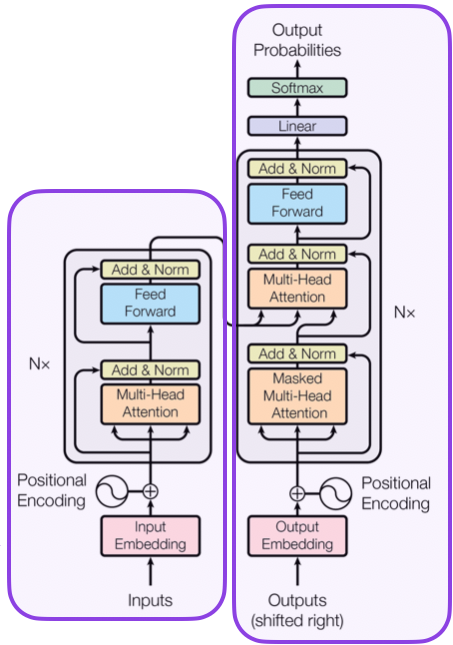
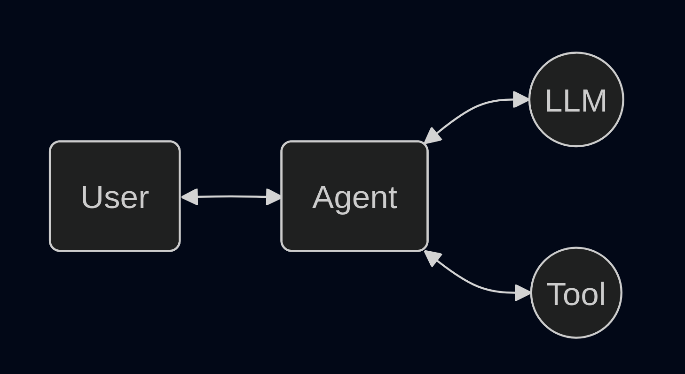
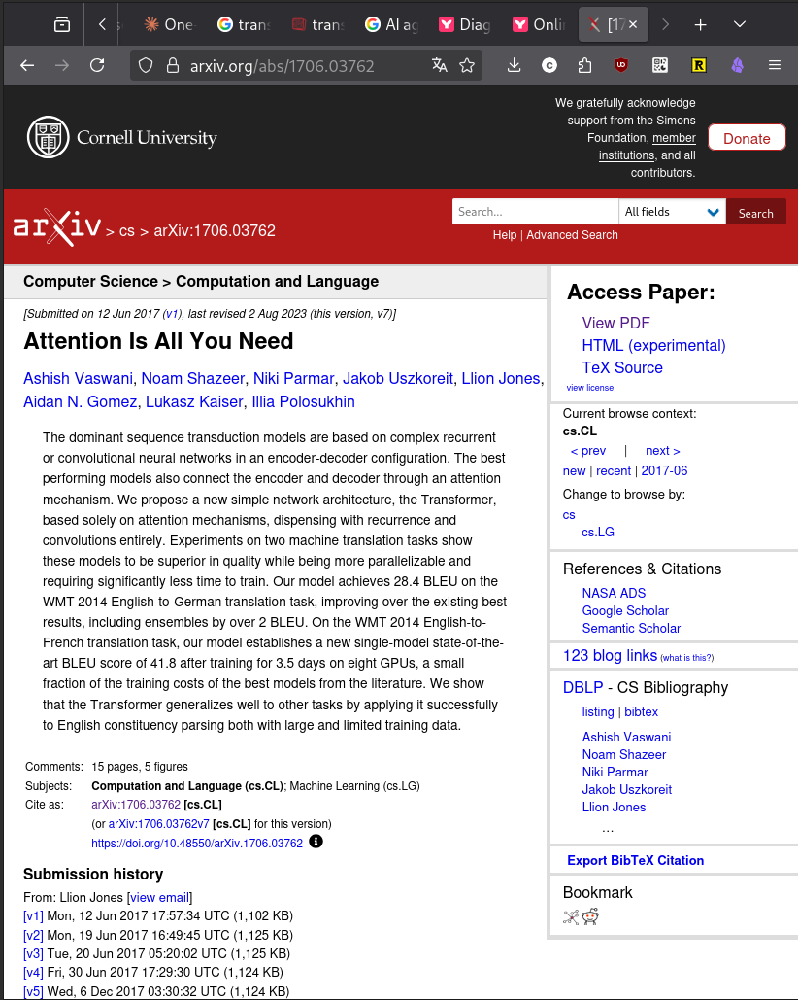
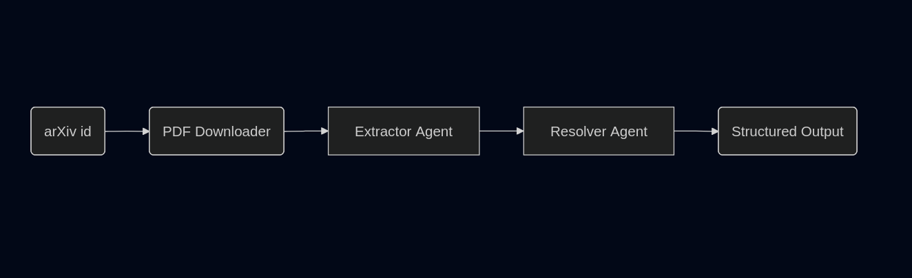

---
class:
  - lead
  - invert
marp: true
theme: default
paginate: true
footer: Alberto Cámara - JEDAI ITIC 2026 - 2026-03-18

---

# Agents IA amb Pydantic AI

### **Alberto Cámara**
**JEDAI ITIC 2026**
2026-03-18

---

# **Alberto Cámara**


github: **[@ber2](github.com/ber2)**

web: **[ber2.github.io](https://ber2.github.io/)**

- **Doctor en Matemàtiques**

- Treballant com a **Data Freelancer**

- Membre de **PyBcn**

- Usuari apassionat de **Python**

<!--
Treballant en diverses àrees de l'espectre de dades però especialitzat en Data Science i ML Engineering

No em consideraria un expert en Python

Gràcies als organitzadors del JEDAI per preparar-ho tot
-->

---

## La IA és com conduir

Tothom creu que ho fa bé.
Les estadístiques diuen el contrari.
I de tant en tant hi ha accidents.

<!--
Això s'aplica a gairebé qualsevol tecnologia de moda.

Ho hem vist amb Big Data, la IA, etc
-->

---



## Glossari de termes

* **LLM** - Una xarxa neuronal que pot predir i generar text
* **Agent** - Un sistema que percep el seu entorn i pren accions per assolir objectius
* **AI Agent** - Un agent autònom que utilitza LLMs per decidir quines accions prendre

<!--
LLM és una definició molt àmplia perquè depèn de la mida de la xarxa neuronal i de com de versemblant és el text generat

Agent ve del Reinforcement Learning
-->

---




<!--
Una imatge de partida senzilla

Això pot arribar a ser tan complicat com calgui: seqüència d'accions, bucles...
-->

---



## Avui treballarem amb **articles d'arXiv**

- Repositori d'accés obert d'articles científics
- IDs d'articles estandarditzats
- Més de 2 milions d'articles de física, matemàtiques, informàtica, etc.


<!--
**Per què és un bon exemple?**
- PDFs del món real amb dades desordenades
- Format estructurat però inconsistent
- Perfecte per a tasques d'extracció
-->

---

## El nostre repte: Extreure dades d'autors

**Entrada:** ID d'article d'arXiv

**Sortida:** Dades estructurades d'autors i afiliacions

**Exemple:**
```json
{
  "arxiv_id": "1706.03762",
  "authors": [
    {
      "name": "Ashish Vaswani",
      "affiliations": ["Google Brain"]
    }
  ]
}
```
---




<!--
Arquitectura de dos agents

L'Extractor és responsable de llegir tot l'article i obtenir informació sobre autors i afiliacions.

El Resolver és responsable de normalitzar les afiliacions en noms estandarditzats i detectar problemes.

La normalització automàtica d'afiliacions d'autors és un problema real
-->

---


## Per què fer servir Pydantic?

- Llibreria de **validació de dades** per a Python
- Construïda al voltant de la **seguretat de tipus** i les **dades estructurades**

* Utilitza **Rust** internament
* Usada a **FastAPI**, **LangChain**, **SQLModel** i molts altres projectes

<!--
Una gran part de la interacció amb els LLMs gira al voltant de la validació dels seus resultats.

Pydantic aprofita els type hints de Python modern.

Hi ha un patró molt útil de modelar les entrades i sortides com a models Pydantic i construir una API a sobre gairebé automàticament.
-->

---

## Pydantic AI

És un framework de Python dissenyat per construir aplicacions i fluxos de treball amb agents d'IA.

* Enfoc en l'extracció de **dades estructurades** de **fonts no estructurades**

* **Sortides amb seguretat de tipus** garantides pels models Pydantic

* **Agnòstic al model**: dissenyat perquè sigui possible canviar de LLM sense canviar el codi

<!--
L'agnòsticisme al model és important per la velocitat a la qual canvia l'estat de l'art

No us caseu amb un proveïdor ni amb un LLM concret
-->

---

## Comparació d'alternatives

- **Pydantic AI**: Extracció estructurada, API senzilla, lleuger
- **LangGraph**: Fluxos complexos, màquines d'estat, abast més ampli
- **LlamaIndex**: Pipelines RAG, extracció de PDFs, pesat

* Tots són **agnòstics al model**: Ollama, Gemini, OpenAI, etc
* Tots accepten validació contra models Pydantic

<!--
Eines molt útils cadascuna amb el seu cas d'ús
-->

---

# Anem a programar!

### https://github.com/ber2/2026-jedai-agents-pydantic-ai

---

# Extensions possibles

- **Més agents:** Afegir extractor de cites, resum d'abstracts
- **Bucles de validació:** El Resolver crida l'Extractor en cas de problemes de normalització
- **Processament per lots:** Processar múltiples articles
- **Formats d'exportació:** JSON, CSV, base de dades
- **Integració:** Connectar amb gestors de referències
- **Millor validació:** Usar APIs externes (ORCID, ROR)

---

## Recursos

**Documentació:**

- Pydantic AI: https://ai.pydantic.dev
- Ollama: https://docs.ollama.com/
- Logfire: https://logfire.pydantic.dev

---

# Gràcies

